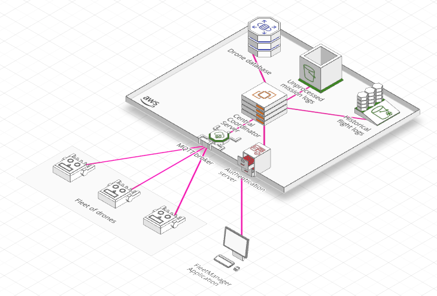

    
    <h2>Architecture Overview</h2>
    

## Repositories
Core infrastructure and tooling for distributed systems development. Each repository implements focused functionality within the broader ecosystem architecture.

## License
Individual repository licensing applies per project requirements.
